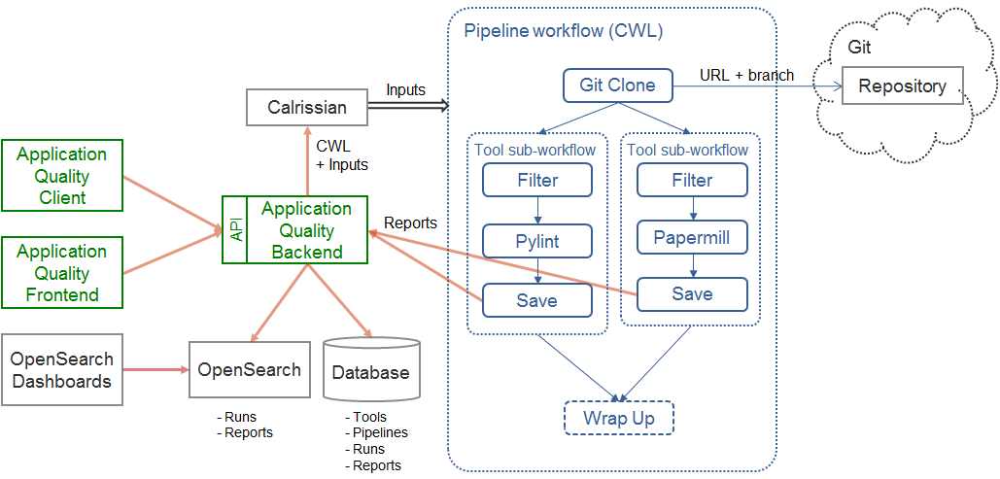
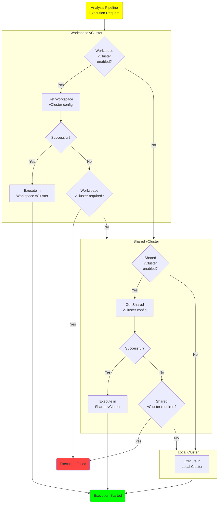

# Architecture

## Static Architecture

The *Application Quality* Building Block integrates a number of services that together implement its three main components: Development Best Practice, Application Quality Tooling and Application Performance.

This figure depicts the main constituents of the *Application Quality* BB and its external interfaces:


The Building Block includes the following components:

- The *Application Quality Database* is used to store the data collected and generated in the Building Block, including:
  - The definition of analysis tools. The tools allow performing various tasks including code quality (pylint, flake8, SonarQube), security (Bandit), documentation generation (Sphinx, Swagger), dependency analysis (pyenv, pipreqs), and unit testing (pytest).
  - The definition of the analysis pipelines.
  - The pipeline execution requests (triggers)
  - The information collected during the pipeline executions, including the generated analysis reports.
- The *Application Quality Web Portal* (front-end) allows the users to discover the integrated analysis tools, to discover and manage (create, edit, delete) analysis pipelines, execute these pipelines and inspect the reports.
- The *Application Quality API* is the back-end service responsible for serving the data to the Web Portal and to client applications, for communicating with the database, and for orchestrating the execution of the pipelines. 
- The *Application Quality Dashboards* is a web application that allows displaying the pipeline executions and reports in customisable dashboards and visualisation components. This component is implemented using the open source data visualization and monitoring solution [Grafana](https://grafana.com/docs/grafana/latest/).
- The *CWL Runner* runs and manages the pipeline life-cycle in the Kubernetes cluster. The [Calrissian](https://duke-gcb.github.io/calrissian) software product and the [PyCalrissian](https://github.com/Terradue/pycalrissian) helper library are used to implement this component.

The Web-portal and the backend API may be used to execute pipelines on-demand however the Building Block relies on the Notification Service and the Automation Service for providing application analysis automation.

- In the *Notification Service*, communication channels are used as follows:
  - A *Requests* channel is used to receive analysis (i.e. pipeline execution) requests. These requests may be issued by other components in the platform or generated automatically by the *Automation Service*.
  - A *Results* channel is used to inform about the availability of analysis reports.
  - [To be confirmed] A *Processing* channel is used to issue application execution requests to the Processing Service (e.g. for executing applications specified using Application Packages).
- The *Automation Service* is configured to generate and submit analysis requests through the *Requests* channel when certain events are received (e.g. the push of a new application version in a git repository).

The API (back-end) component has the following main tasks:
  1. It listens for pipeline execution requests on a dedicated notification channel.
  1. When an analysis request is received, it retrieves the appropriate pipeline definition from the database, renders the CWL file (providing the input values) and submits the resulting CWL document to the CWL Runner.
  1. During the pipeline executions, it receives the reports generated by the analysis tools and stores them in its database.
  1. In order to perform the performance analysis, it executes applications (processing workflows) in a test environment and collects the execution metrics (execution times, resources consumed, etc.) Note: This may be done by deploying and executing the applications using the [EOEPCA ADES](https://eoepca.readthedocs.io/projects/deploy/en/stable/eoepca/ades-zoo/) provided it allows targeting dedicated worker nodes and provided it gives access to the execution metrics.
  1. It sends notifications through dedicated channels to inform the requesters about the progress. If the Notification Service allows creating channels on-the-fly with hierarchical subjects, a new channel will be created for each running pipeline.

Each individual tool that may be integrated in the Development Best Practice and Application Quality pipelines is containerized and specified in CWL "CommandLineTool" (CLT) resources. Tool-specific input parameters may be exposed and used to control their behaviour. The integrated analysis tools are described in the [Analysis Tools](../usage/analysis-tools.md) section.

>**Note**: The static architecture diagram above does not show the interactions that are taking place between the tools integrated in the Application Quality pipelines and external services. Indeed, pipeline steps may need to communicate with external services to perform their tasks. For example, the very first step of a pipeline retrieves the application code and artifacts from a git repository. This is performed by a pipeline job, not the building block itself. Similarly, the SonarQube analysis tool has a client / server architecture: the SonarQube client may be integrated in an analysis pipeline but the actual analysis is performed by the SonarQube server, running independently.

## Pipeline Execution

The figure below depicts the structure of an analysis pipeline and its interations with the building block components and external services.

An analysis pipeline (defined as a CWL workflow) usually starts with a *Git Clone* step which fetches the application files from a git repository and makes them available to the analysis tools that are executed next. The pipeline then executes one or more anlaysis tools also specified as CWL workflows.

A typical tool workflow includes three or more steps (see *Pylint* and *Papermill* on the figure): the first step applies a filter on the input files to only keep the files to be analysed. In the example, *Pylint* can select one or more Python scripts (`.*\.py`) and Papermill can select one or more Jupyter Notebooks (`.*\.ipynb`). The next step executes the tool itself and thus performs the actual analysis on the filtered files. The last step sends the analysis report(s) to the service backend for persitent storage.

More complex tools may require additional steps. *SonarQube*, for example performs the analysis and stores the results in a remote server. The analysis workflow thus integrates the SonarQube client that communicates with the server for performing the analysis. Results of this analysis must then be retrieved from the server before being saved using the building block backend.

The analysis tools are independent from each other: the failure of one tool does not prevent executing the other tools. They are thus directly linked to the initial *Git Clone* step, if present, and may be executed simultaneously if the cloud resources permit it.

The tool-specific workfllows are pre-defined in the service. Adding more tools is possible but requires creating Docker images and editing the service database manually.

The Application Quality Building Block proposes pre-defined analysis pipelines that may be executed by any authenticated user (see [Analysis Tools](../usage/analysis-tools.md)). It also integrates a pipeline editor that allows users creating and configuring user-defined (private) pipelines (see [User Manual](../usage/user-manual.md#user-defined-pipelines)).



## Sandboxed Execution Environments

Analysis pipelines may be executed in sandboxed environments, provisioned with the [vCluster](https://www.vcluster.com/) technology.

The following options are available, in decreasing order of priority:

1. Execution in a **Workspace vCluster**, provisioned by the [Workspace Building Block](https://eoepca.readthedocs.io/projects/workspace).
1. Execution in a **Shared vCluster** provisioned by the Application Quality service itself.
1. Execution in the **local hosting cluster** (thus not providing a sandboxed environment).

The backend service attemps to execute the analysis pipelines in the appropriate environment, depending on the configuration. Once it has obtained a cluster configuration (local or virtual), it instructs the CWL pipeline helper library (PyCalrissian) to instanciate and run Calrissian (and thus the `cwl-runner`) in the corresponding environment.

To enable the use of **Workspace vClusters**, use the following Helm chart values:

```yaml
workspace:
  # Internal cluster address for communicating with the Workspace API.
  apiServiceUrl: "http://workspace-api.workspace.svc.cluster.local:8080"
  vcluster:
    # Whether Workspace vClusters should be used.
    enabled: true
    # Whether pipelines are required to be run in Workspace vClusters.
    # If required, no other options (Shared vCluster, local cluster)
    # are attempted.
    required: false
```

To enable the use of a **Shared vCluster**, use the following Helm chart values:

```yaml
vclusters:
  # Whether a Shared vCluster should be used.
  enabled: false
  # Whether pipelines are required to be run in a Shared vClusters.
  # If required, the local cluster option is not attempted.
  required: false
```

The decision logic is depicted in this flowchart:


