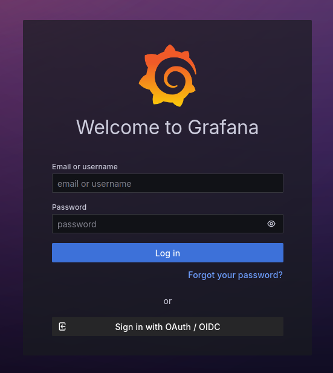
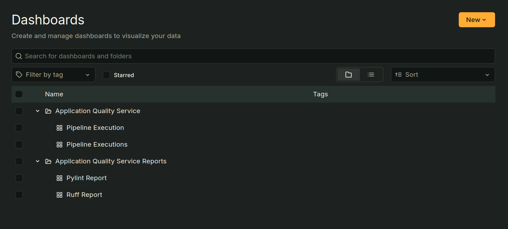
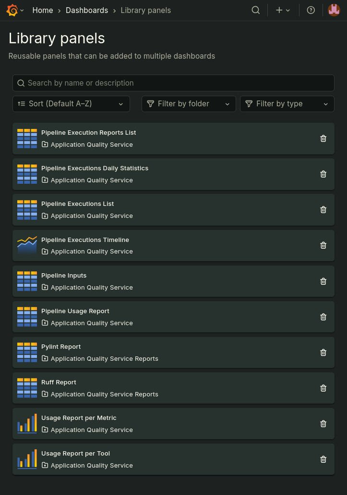
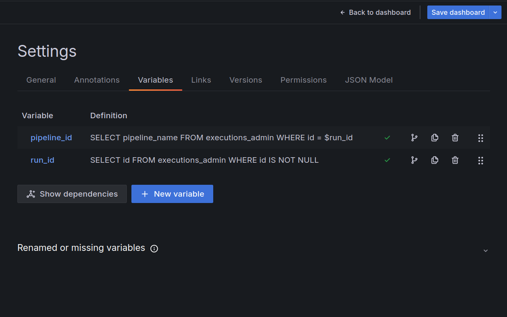
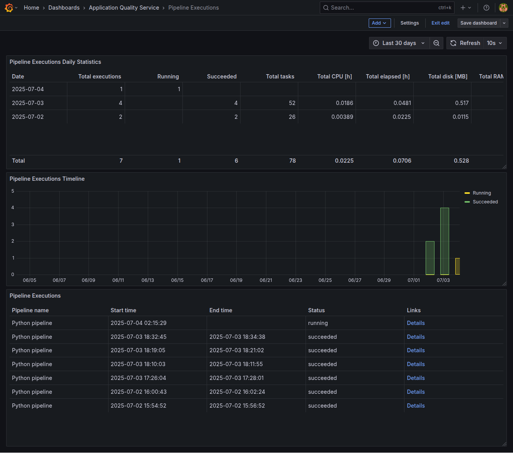
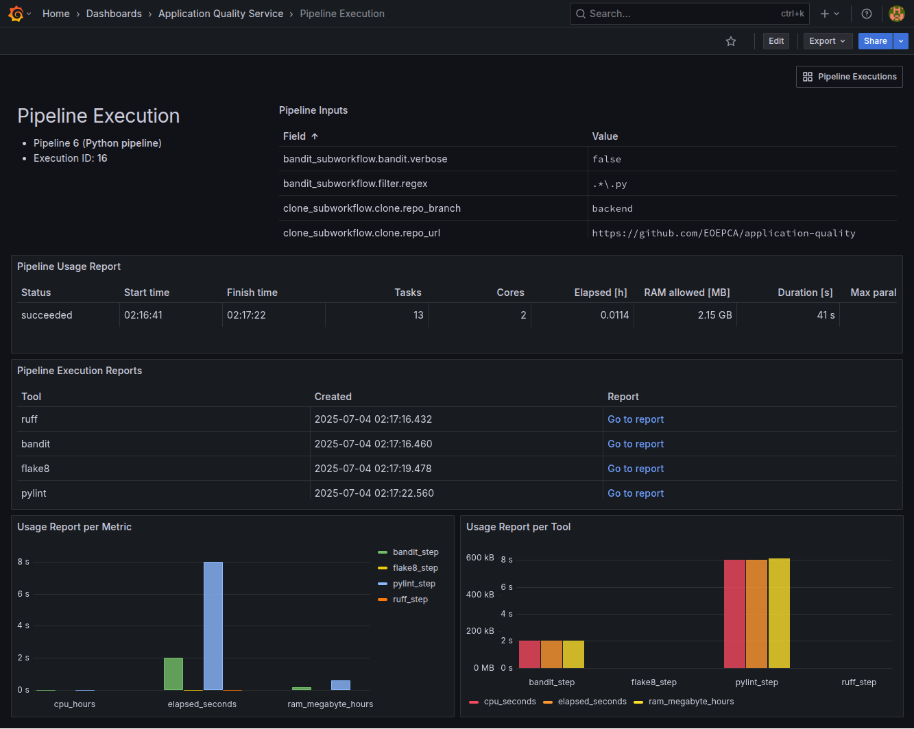
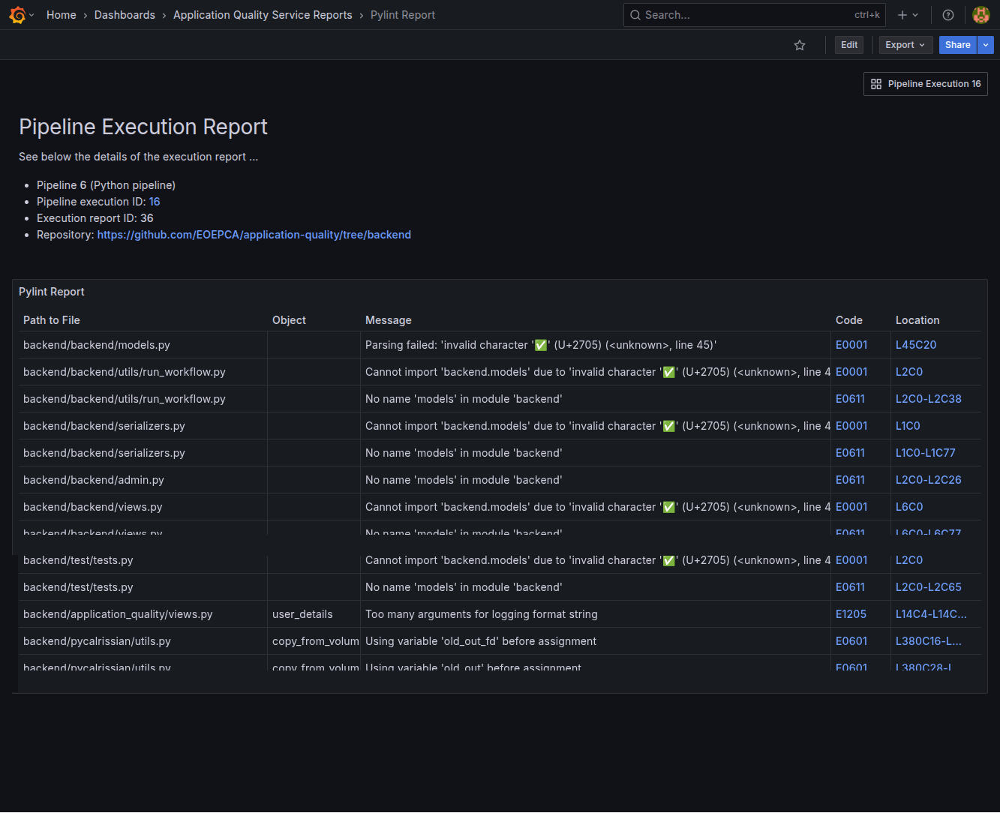

# Analysis Dashboards

The Application Quality Service integrates with **Grafana** to visualise the various reports and metrics generated during pipeline executions.

Dashboards are accessible from the **Service User Portal** by clicking the dashboards icon  in the navigation bar. Each report and pipeline is also associated with a dedicated dashboard in Grafana, accessible through the dashboards icon  in each row on the **Monitoring** and **Reports** pages.

> Grafana Open Source Software (OSS) enables you to query, visualise, alert on, and explore your metrics, logs, and traces wherever they're stored. [...] Grafana OSS provides you with tools to display that data on live dashboards with insightful graphs and visualizations.

You can access Grafana documentation [here](https://grafana.com/docs/grafana/latest/).

<!-- Add screenshots of the UI with the dashboard icon -->

## Authentication

Authentication works the same way as in the **Service User Portal**. On the Grafana login page, click the button at the bottom of the form to be redirected to the IAM login page.

Users can log in with their IAM credentials, the same that they use for the Service User Portal, as both services rely on the same IAM instance.

## Dashboards

### Default Dashboards

The default dashboards are organised into these two folders:

- **Application Quality Service**: contains dashboards related to pipelines and pipeline runs.

- **Application Quality Service Reports**: contains dashboards related to individual tool reports.

A set of preconfigured library panels is provided. Users can import these panels into their own dashboards as needed. New panels may be created as well.

> NOTE: Some panels use **dashboard variables** in their SQL requests and will display errors if these are not correctly set up. You can create them by navigating to the dashboard settings: **Edit** > **Settings** > **Variables**.

 <!-- This should show `executions` instead of `executions_admin` -->

A number of dashboards are provided by default.

The **Pipeline Executions Dashboard** provides statistics of past and ongoing executions, a timeline, and the list of executions:

The **Pipeline Execution Dashboard** shows information about a specific pipeline execution, including the input parameters, the resources consumption, and the list of executed analysis tools:

The **Analysis Report Dashboards** display the reports generated by the analysis tools (here: a PyLint report):

### Custom Dashboards

Users have the ability to customise their dashboards by reorganising panels, creating new dashboards, or adding new visualizations based on their executed pipelines and job reports.

- Dashboards documentation: https://grafana.com/docs/grafana/latest/dashboards/
- Panels documentation: https://grafana.com/docs/grafana/latest/panels-visualizations/

> NOTE: When customising or creating new panels, the PostgreSQL data source must be selected to ensure the proper retrieval of the Application Quality metrics and reports.

<!-- ## Users and Access

Each user has access to a **personnalised database view** that lists only their own pipeline executions and job reports. Grafana dashboards reflect this filtered data, ensuring each user sees only their relevant information. -->
