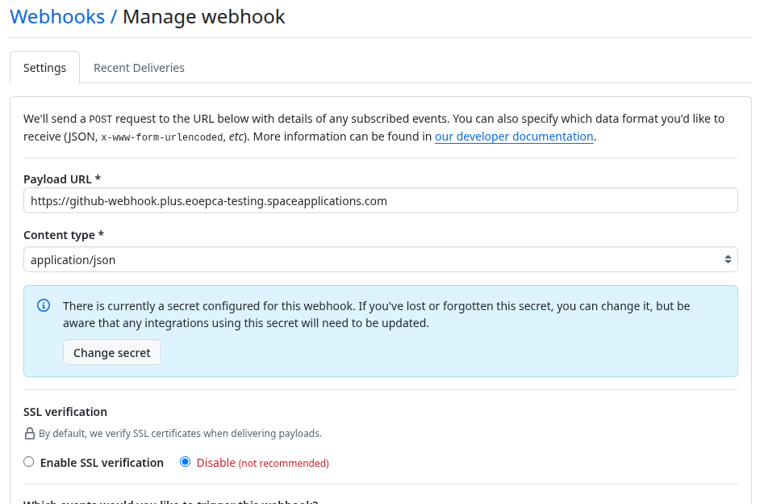
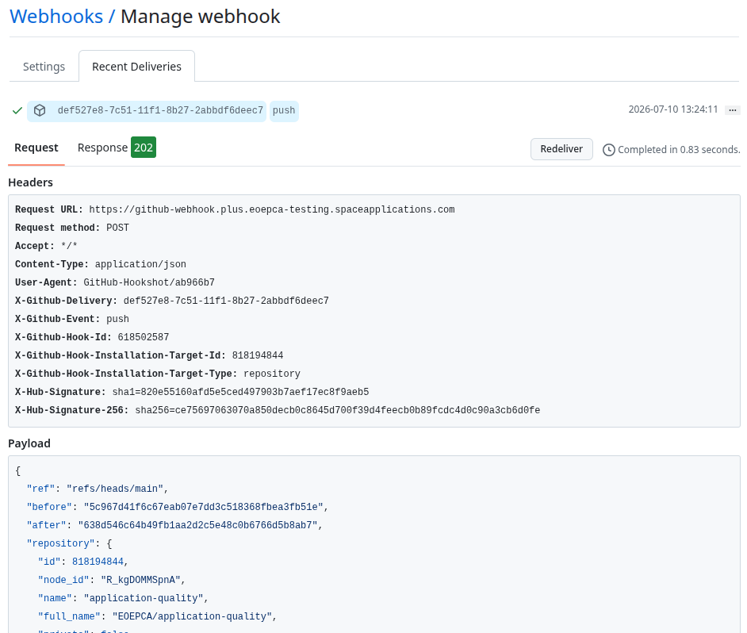
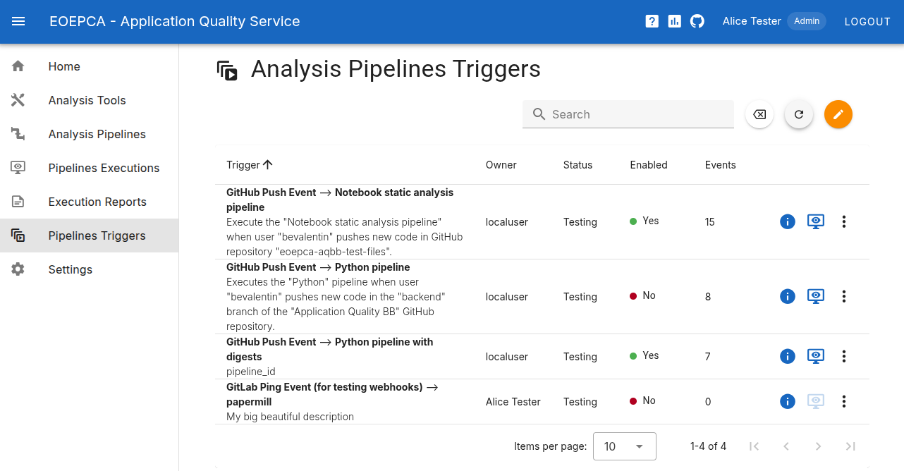
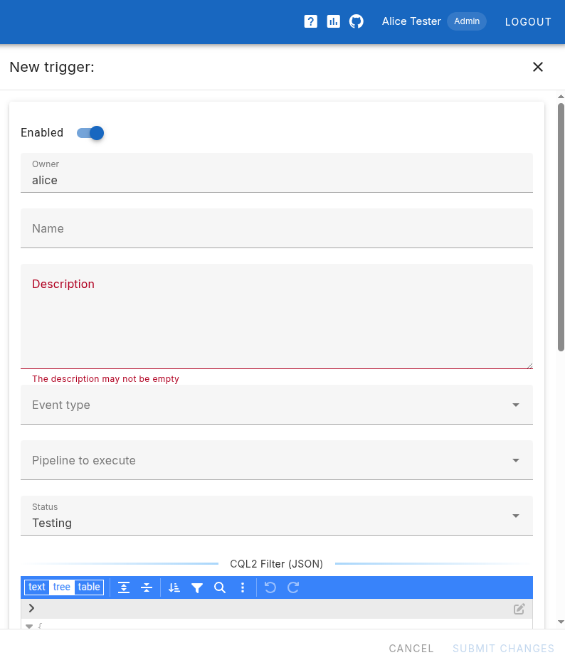
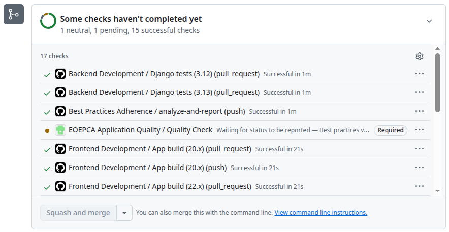
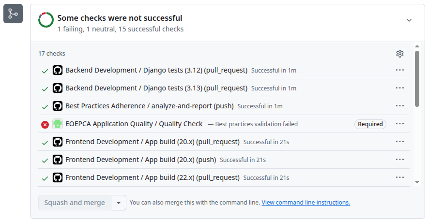
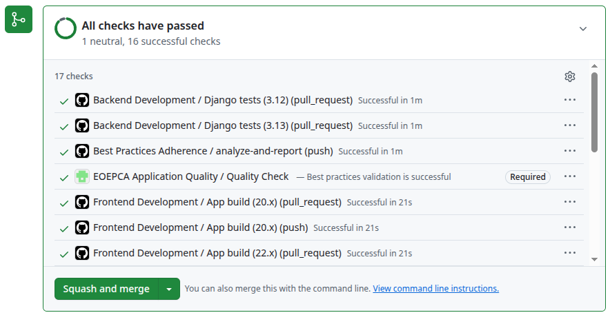
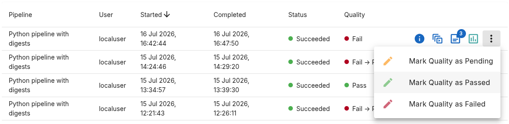

# Pipeline Execution Automation

## Introduction

Triggers may be defined to automate the execution of analysis pipelines when external events occur.

The events must be delivered as [CloudEvents](https://github.com/cloudevents/spec) to the *Application Quality* service backend.

An implementation of this mechanism uses the [Knative Eventing](https://knative.dev/docs/eventing/) middleware, powering the *Notification and Automation* BB, and the [Webhook Source function](https://github.com/EOEPCA/na-webhook-source), implemented in the context of EOEPCA.

## Deployment and Setup

### Knative and the Webhook Source Function

The procedures for deploying these components are described in their respective documentation:

* [Knative Eventing](https://knative.dev/docs/eventing/)
* [Notification and Automation BB](https://eoepca.readthedocs.io/projects/notification-automation/en/latest/)
* [N&A BB Webhook Source](https://github.com/EOEPCA/na-webhook-source#deployment)

### Application Quality Service Trigger

A *Knative Eventing Trigger* resource must be created in the Kubernetes environment to tell the Knative Broker to deliver the events having a given type (i.e. matching a filter) to the *Application Quality* backend (the Subscriber).

The Helm Charts template for the Knative Trigger can be found in the [GitHub Application Quality repository](https://github.com/EOEPCA/application-quality/blob/reference-deployment/helm/templates/api-notifications.yaml).

This is configured with the following values:

```yaml
  notifications:
    enabled: true
    middleware: "knative"
    # The Knative Trigger is created in the same namespace as the Broker
    brokerName: "default"
    brokerNamespace: "na"
    # Also used as type prefix for incoming events
    channelPrefix: "org.eoepca.application-quality"
    responseSource: "/eoepca/application-quality"
    responseTypePrefix: "org.eoepca.application-quality.response"
```

The example *Trigger* resource, below, considers the following:

* The *Broker* to connect to is deployed in the `na` namespace and is named `default`.
* The Webhook is configured to process events issued by GitLab and GitHub. The Webhook automatically sets the appropriate event type (e.g. `org.eoepca.webhook.github.push`) in the CloudEvents.
* The *Application Quality* service is deployed in the `application-quality` namespace. The backend pod name is `application-quality-api` and the CloudEvents must be delivered to the `/api/events` endpoint.

!!! note
    The *Trigger* must be deployed in the same namespace as the *Broker*.

```yaml
apiVersion: eventing.knative.dev/v1
kind: Trigger
metadata:
  labels:
    argocd.argoproj.io/instance: application-quality-core
    eventing.knative.dev/broker: default
  name: org.eoepca.application-quality.events
  namespace: na
spec:
  broker: default
  filters:
  - any:
    - prefix:
        type: org.eoepca.webhook.github.
    - prefix:
        type: org.eoepca.webhook.gitlab.
  subscriber:
    ref:
      apiVersion: v1
      kind: Service
      name: application-quality-api
      namespace: application-quality
    uri: /api/events/
```

### GitHub Webhooks

GitHub repositories must be configured to send events when certain actions are executed.

Steps:

1. In the GitHub Web interface, access the **Webhooks** page in the repository **Settings**.
2. Click on **Add Webhook**. Use your passkey if asked.
3. In the form, do the following:
   - **Payload URL**: *Public address of the Knative Webhook Source (ingress URL)*
   - **Content type**: Select `application/json`
   - **Secret**: *The secret string configured in the Knative Webhook Source*
   - **Enable SSL Verification**: *It is recommended to enable this*
   - **Which events...?** => Let me select individual events.
   - In the events list, select **Pull requests** and **Pushes**.
   - **Active**: *Check to enable the webhook*
4. Click on **Add webhook**.

Once created, the Webhook definition can still be edited and the recent deliveries may be inspected. Recent deliveries may also be redelivered for testing purpose.

GitHub Webhook Manage page:



GitHub  Webhook Recent Deliveries:




## Analysis Pipeline Triggers

The above *Trigger* resource asks the Broker to deliver any event issued by GitLab and GitHub to the Application Quality service.

The Analysis Pipelines that must be executed and the conditions to do so are configured in the Application Quality Web portal.

The **Pipeline Triggers** page allows creating and managing Analysis Pipelines Triggers:



Click on the edit icon to display the creation form:



Give the Trigger a name, description and status. These are mandatory but have no impact on the service behaviour.

The **Enabled** switch, at the top, allows disabing a Trigger (matching events are then ignored), without deleting it.

Select an *Event Type* (e.g. "GitHub Push Event"), and the Analysis Pipeline to execute when a matching event is received.

!!! note
    Pre-defined *Event Types* are created automatically in the backend database. More types may be added by an administrator.

The form also includes two JSON fields: the first one allows specifying a CQL2 Filter and the second one is for providing Default Input Parameters.

The CQL2 Filter applies on the CloudEvent properties found in the event body.

### Example GitHub Push Event Trigger

This example CQL2 filter, below, indicates that the selected Analysis Pipeline must be executed if the `push` action has been performed by `bevalentin` in the `backend` branch of the repository `EOEPCA/application-quality`.

!!! note
    Push events are submitted by GitHub whether the related commits belong to a Pull Request or not. To trigger Analysis Pipelines when a Pull Request is created or updated (to prevent merging in case of issues, for example), use the trigger type **GitHub Pull Request** (see below).

```json
{
  "op": "and",
  "args": [
    {
      "op": "=",
      "args": [
        {
          "property": "repository.full_name"
        },
        "EOEPCA/application-quality"
      ]
    },
    {
      "op": "=",
      "args": [
        {
          "property": "ref"
        },
        "refs/heads/backend"
      ]
    },
    {
      "op": "=",
      "args": [
        {
          "property": "sender.login"
        },
        "bevalentin"
      ]
    }
  ]
}
```

The following example defines default parameters for the selected pipeline:

```json
{
  "parameters": {
    "ruff_subworkflow": {
      "ruff": {
        "verbose": false
      },
      "filter": {
        "regex": ".*\\.py"
      }
    },
    "clone_subworkflow": {
      "clone": {
        "repo_url": "https://github.com/EOEPCA/application-quality",
        "repo_branch": "backend"
      }
    },
    "bandit_subworkflow": {
      "bandit": {
        "verbose": false
      },
      "filter": {
        "regex": ".*\\.py"
      }
    },
    "flake8_subworkflow": {
      "filter": {
        "regex": ".*\\.py"
      },
      "flake8": {
        "verbose": false
      }
    },
    "pylint_subworkflow": {
      "filter": {
        "regex": ".*\\.py"
      },
      "pylint": {
        "disable": "E0401,C0114,C0115,C0116",
        "verbose": false,
        "errors_only": false
      }
    },
    "notebook-bp-validator_subworkflow": {
      "filter": {
        "regex": ".*\\.ipynb"
      },
      "notebook-bp-validator": {
        "schema": "eumetsat",
        "abspath": false
      }
    }
  }
}
```

### Example GitHub Pull Request Trigger

This example CQL2 filter, below, indicates that the selected Analysis Pipeline must be executed if the action has been performed by `bevalentin` in the `backend` branch of the repository `EOEPCA/application-quality`, and a pull request exists for that branch.

```json
{
  "op": "and",
  "args": [
    {
      "op": "=",
      "args": [
        {
          "property": "repository.full_name"
        },
        "EOEPCA/application-quality"
      ]
    },
    {
      "op": "=",
      "args": [
        {
          "property": "pull_request.head.ref"
        },
        "backend"
      ]
    },
    {
      "op": "=",
      "args": [
        {
          "property": "sender.login"
        },
        "bevalentin"
      ]
    }
  ]
}
```

Default parameters for the selected pipeline may be specified as show in the example, above.


## Reporting Quality Status in GitHub Pull Requests

GitHub allows configuring protection rules on selected branches.

A typical scenario consists in protecting the `main` branch against changes that may have unexpected, negative impact, such as changing the behaviour or introducing bugs.

To activate this mechanism, apply these steps:

1. Create a GitHub API Access Token.
1. Configure the Application Quality Service (environment variables in `secrets` and `configmap`).
1. Create a Branch Protection Rule.
1. Verify the branch protection is working properly.

Each steps is details hereafter:

### Create a GitHub API Access Token

To create a GitHub API Token:

1. **Developer Settings**
    * In the top-right corner of GitHub, click your profile picture **Settings**.
    * In the left sidebar, scroll down to the very bottom and click **Developer settings**.

2. **Generate a Fine-Grained Token**
    * In the left sidebar, expand **Personal access tokens** and click **Fine-grained tokens**.
    * Click the **Generate new token** button.

3. **Configure the Token Details**
    * **Token name:** Give it a clear name like `eoepca-appquality-status`.
    * **Expiration:** Set an expiration period (e.g., 90 days or custom).
    * **Resource owner:** Select your account or the organization that owns the target repository.

4. **Restrict Repository Access**
    * Under **Repository access**, change it from *All repositories* to **Only select repositories**.
    * Select the specific repository from the dropdown list.

5. **Grant Status Permissions Only**
    * Scroll down to **Permissions** and expand **Repository permissions**.
    * Locate **Commit statuses** in the list.
    * Change its dropdown access level from *No access* to **Access: Read and write**.
    * Leave all other dropdown selections as *No access*.


6. **Generate & Copy**
    * Click **Generate token** at the bottom of the page.
    * **Copy the token immediately.** GitHub will never show it to you again once you navigate away from the page. The GitHub API Token starts with `github_pat_`.


### Configure the Application Quality Service

Configure Application Quality backend pod with the following environment variables:

| Variable                    | Description                                                                    |
| --------------------------- | ------------------------------------------------------------------------------ |
| `GITHUB_STATUS_ENABLED`     | Set to `true` to activate the mechanism globally. Default value: `false`. |
| `GITHUB_API_TOKEN`          | *Optional* - GitHub API Token used if no organisation specific token is matching. Note: At least an organisation specific or a global token must be configured. |
| `GITHUB_API_TOKEN__<org>`  | *Optional* - GitHub API Token used if a status must be updated in a repository belonging to the `<org>` organisation. Additional tokens may be defined for other organisations. By default, the value of `GITHUB_API_TOKEN` is used. For example: `GITHUB_API_TOKEN__EOEPCA` |
| `GITHUB_STATUS_CONTEXT`     | The name of the status (named "context" in GitHub). For example: `EOEPCA Application Quality / Quality Check`.     |
| `GITHUB_STATUS_DESCRIPTION` | A description string submitted with the new status. For example: `Application quality metrics met all threshold guidelines`. It is displayed in the related Pull Requests. |
| `GITHUB_STATUS_TARGET_URL`  | A URL submitted with the new status. For example: https://application-quality.develop.eoepca.org. This is displayed as a link in the related Pull Requests. |

For security reasons, the GitHub API Tokens `GITHUB_API_TOKEN` and `GITHUB_API_TOKEN__<org>` should be provided in a Secret.

These variables are pre-configured in the Helm Charts of the building block. See section `github` in [values.yaml](https://github.com/EOEPCA/application-quality/blob/main/helm/values.yaml).

For example:

```yaml
github:
  enabled: true
  statusContext: "EOEPCA Application Quality / Quality Check"
  statusDescription: "Application quality metrics met all threshold guidelines."
  statusTargetURL: "https://application-quality.develop.eoepca.org/"
```


### Create a Branch Protection Rule

To configure a branch protection rule in GitHub:

1. Navigate to the **Settings** page of the project repository, and select the **Branches** menu entry.
1. Click **Add rule** to create a new rule (or *Edit* an existing one like `main`).
1. Select the branch to protect (e.g. *main*).
1. In the list of protection types, check the box **Require status checks to pass before merging**.
1. Check also the **Do not allow bypassing the above settings** box to prevent regular users to bypass the result of the quality check.
1. In the search box that appears, type the **exact name identifier** configured in the Application Quality servcie (e.g., `EOEPCA Application Quality / Quality Check`). *See the note below*.
1. Click **Create** or **Save changes**.


!!! note
    If the Application Quality service has never posted to the repository before, its name won't show up in the search box yet. You can still type it out manually and hit Enter, or run your external script *once* against a commit so GitHub learns the name.


### Branch Protection in Pull Request

The details page of the Pull Requests targetting the protected branch include a panel informing about the status of the associated workflows and other checks.

The status **EOEPCA Application Quality / Quality Check** is listed as **Required**, meaning that the PR may only be merged if it is a success.

After the PR creation or a push in the source branch, the status is set to *pending*:



The GitHub Webhook configuration and the Pipeline Triggers start the execution of analysis pipelines in the Application Quality service.

If the result of the analysis is not good (quality value derived from the [Analysis Digests](user-manual.md#quality-rules-and-analysis-digests)), the service sets the **EOEPCA Application Quality / Quality Check** status to *failed*.

The merge button remains disabled:



If the results of the analysis is good, the **EOEPCA Application Quality / Quality Check** status is set to *successful*.

The merge button is now enabled (provided there are no other checks preventing the merge):




### Manually Setting the Quality Status

The Application Quality Web portal allows overriding the derived quality status.

Navigate to the [Pipeline Executions Page](#pipelines-executions-page) and expand the menu associated to the pipeline execution to override:



Select the new Quality Status in the menu. The status is modified in the related Pull Request accordingly.