# User Manual

## Introduction

The aim of the Application Quality service is to support the evolution of a scientific algorithm (processing workflow) from a research project to one that can be utilised in a production environment. To achieve this, the Application Quality service provides tools to support verifying non-functional requirements - including code quality, software development best practice for open reproducible science, and optimisation through performance testing.

## Service User Portal

Anonymous (unauthenticated) users may access the service web portal and inspect the available analysis tools and pipelines. They may not create, edit or execute analysis pipelines nor access execution reports. They may also not see nor define [Pipelines Triggers](automation.md).

As seen on the figure below, the portal includes three areas:

- The navigation bar which contains
  - a *hamburger* button for hiding and revealing the side menu,
  - the service name,
  - icons for accessing this User Manual, the [Analysis Dashboards](analysis-dashboards.md), and the source code in GitHub,
  - the login/logout buttons and the name of the authenticated user.
- A side menu that gives access to different resources managed in the service, including the individual analysis tools, the pipelines, the pipeline runs (executions), the execution reports and the pipelines triggers.
- The content of the main area depends on the entry selected in the side menu.

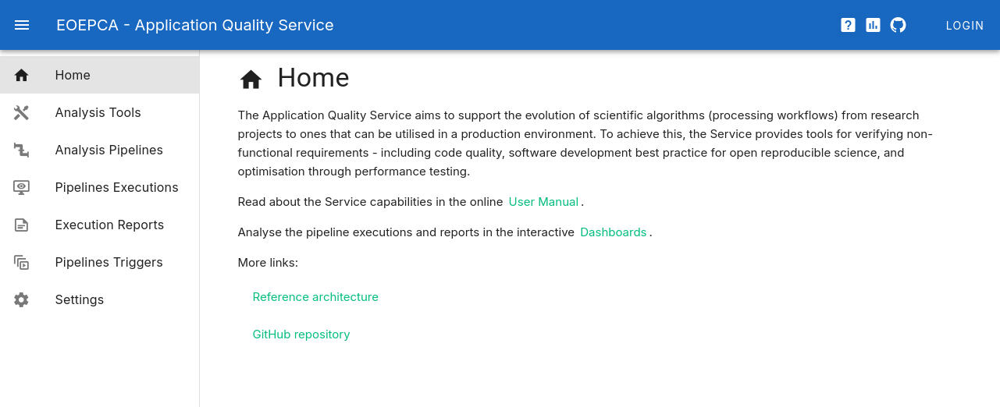


### Authentication

Click on the **LOGIN** link located in the navigation bar to authenticate in the service.

In a default setup, the authentication is performed using the EOEPCA Identity and Access Management (IAM) service. This allows authenticating using a local account or a GitHub account.

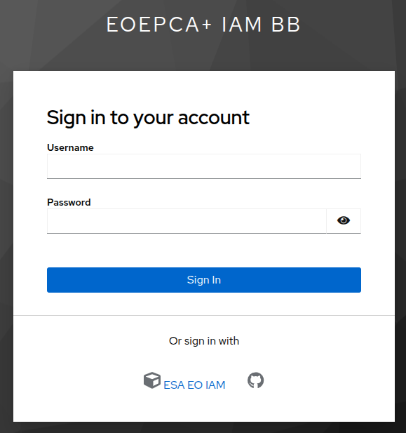

> Note: A confirmation is requested the first time a GitHub account is used to authenticate in an EOEPCA service. In particular it is asked if the user name and email address may be shared with the service.

Upon successful authentication, the web browser is automatically redirected to the service portal. The navigation bar now shows the user name and a **LOGOUT** link.

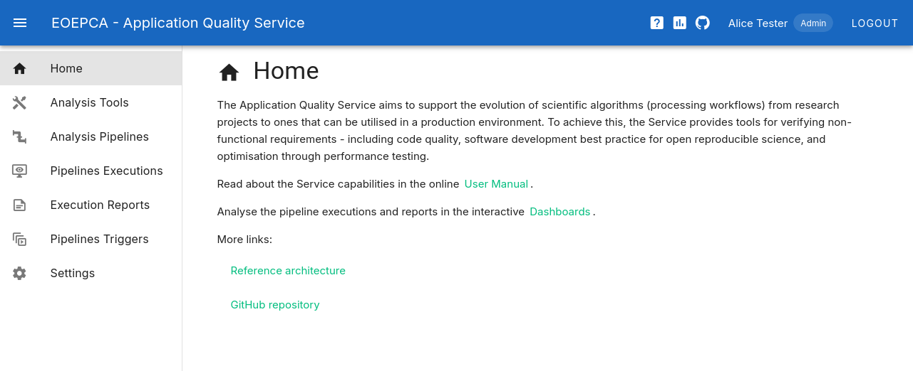

To log out, click on the **LOGOUT** link. The IAM asks for a confirmation then redirects the browser back to the service portal Home page.

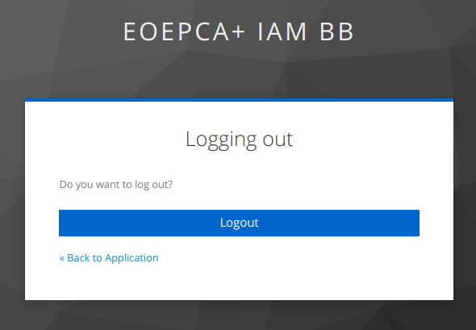

### Inspection of Analysis Tools and Pipelines

Select "**Analysis Tools**" in the side menu to display a table listing the analysis tools configured in the service (see also [Analysis Tools](analysis-tools.md)).

Analysis tools may not be executed indivitually. They must be integrated in analysis pipelines.

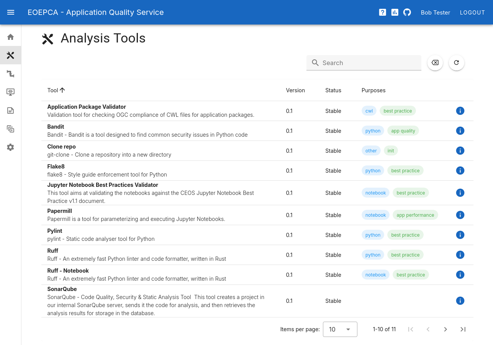

Next to each tool an  icon allows displaying the tool details:

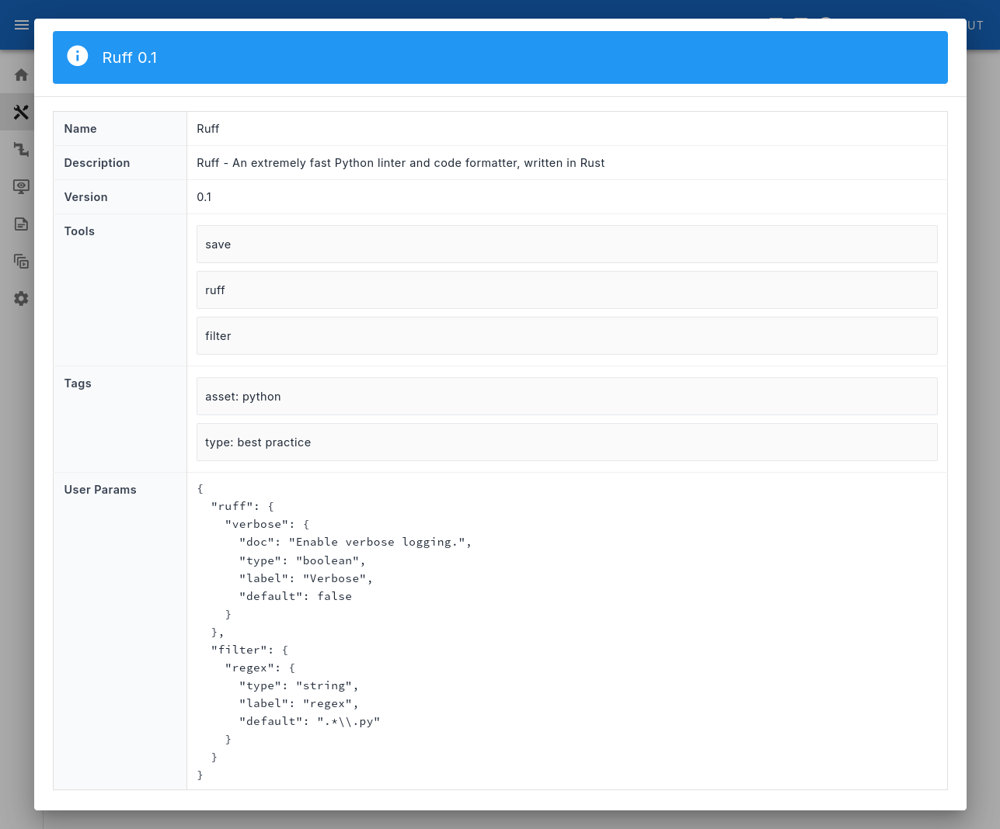


Select "**Analysis Pipelines**" in the side menu to display a table listing the pre-defined analysis pipelines as well as the ones you have created (see below).

A pipeline integrates one or more analysis tools. It may be executed on a given Git repository and branch.

Each row provides the name and version a pipeline as well as a series of action icons:

- Use  to display the pipeline properties, including the list of integrated tools.
- Use  to navigate to the **Pipelines Executions** page and inspect the past and on-going executions of the related pipeline.
- Use  to execute the analysis pipeline.

If you own the pipeline, a 3-dot  menu icon is provided giving access to two additional functions:

- Use  "Edit" to modify the pipeline properties, the list of integrated tools and their parameters.
- Use  "Delete" to delete the pipeline. **Note that this operation cannot be undone.**

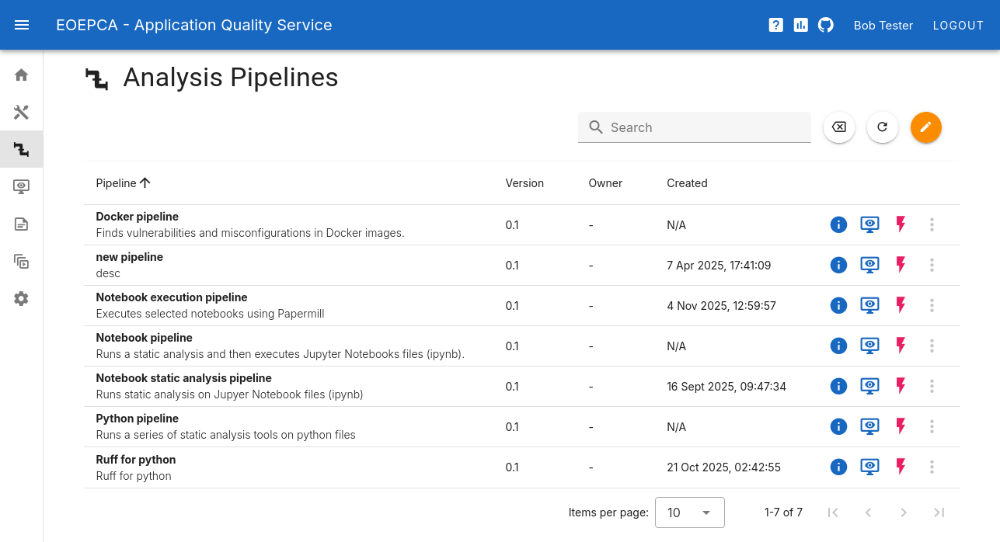

Example pipeline details:

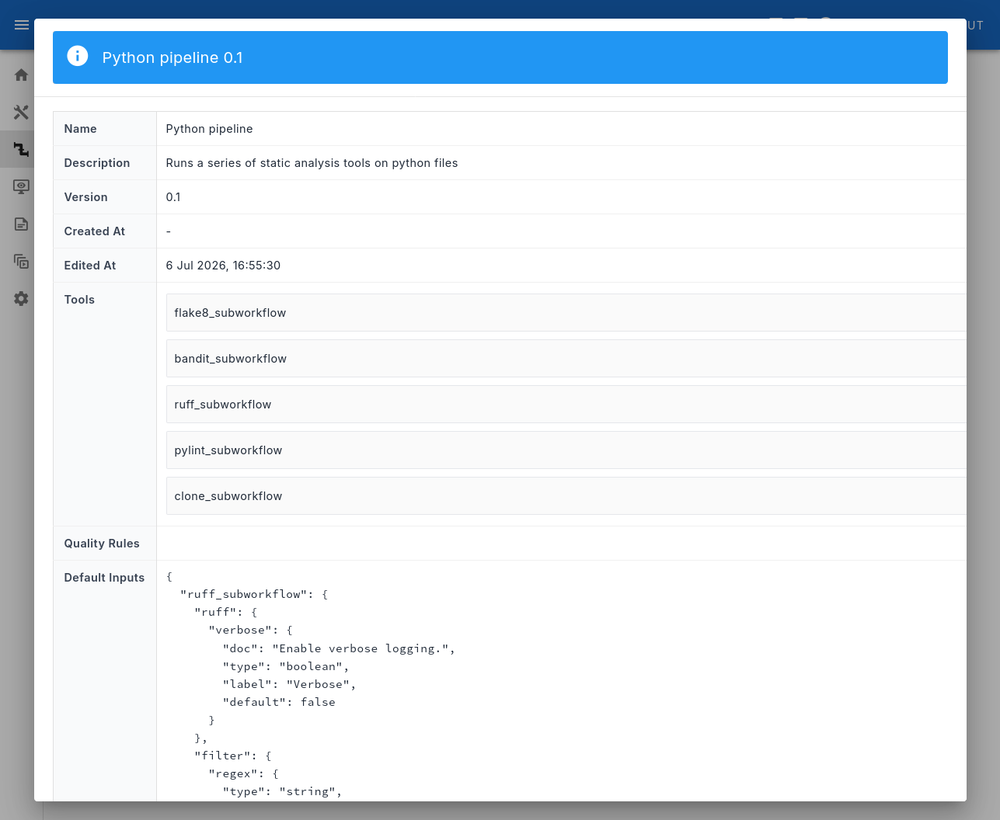

### User-Defined Pipelines

#### Pipeline Creation

The Application Quality service includes pre-defined pipelines that are accessible and may be executed by all authenticated users. These may only be edited or deleted by users having an administration role.

In addition, authenticated users may create and manage their own analysis pipelines, referred as user-defined pipelines.

To create a new pipeline, enter the **Analysis Pipelines** page and click on the pencil icon  located next to the search field and the refresh button.

A pipeline creation panel slides from the right side of the window. This contains a form with the following fields:

- The pipeline name
- The pipeline description (may be left empty)
- The pipeline version (free text)
- An analysis tools selector

Below the form, buttons allow cancelling the pipeline creation or submitting the creation request.

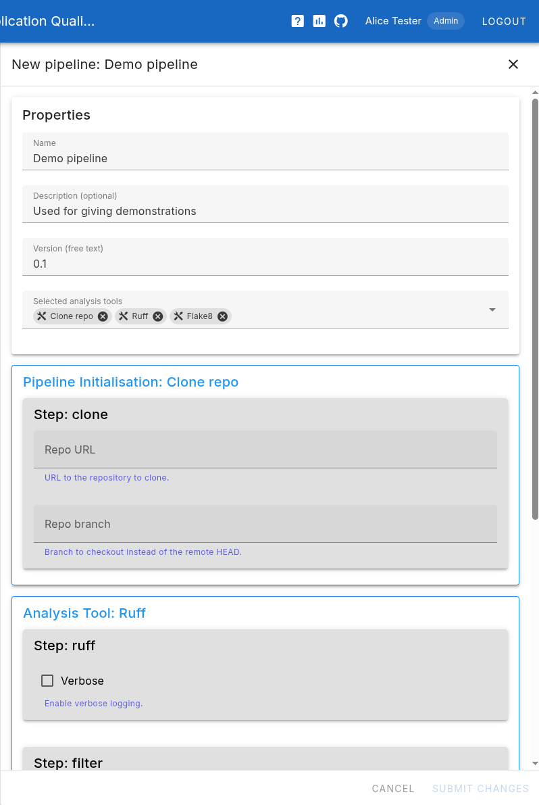

Use the tools selector to select the tools to be added in the analysis pipeline. When a new tool is selected, the form is extended with the tool parameters. The values entered in the tool parameters are used as default values when comes the time to execute the pipeline.

>**Important**: Most tools require "**Git Clone**" to be selected as this is responsible for fetching application files from a git repository. When this is added, a repository URL and a branch name must be provided.

Click on the **SUBMIT CHANGES** button to create the pipeline. The panel is automatically closed and the new pipeline is added to the list.

#### Pipeline Editing

In order to edit one of your analysis pipelines, locate it in the pipelines table, click on the associated 3-dot  menu icon, and select the  "**Edit**" entry.

The pipeline editing panel slides from the right side of the window. This contains the form for modifiying the pipeline. Click on **SUBMIT CHANGES** to save the updated pipeline.

#### Pipeline Deletion

In order to delete one of your analysis pipelines, locate it in the pipelines table, click on the associated 3-dot  menu icon, and select the  "**Delete**" entry.

A dialog box appears asking for confirmation.

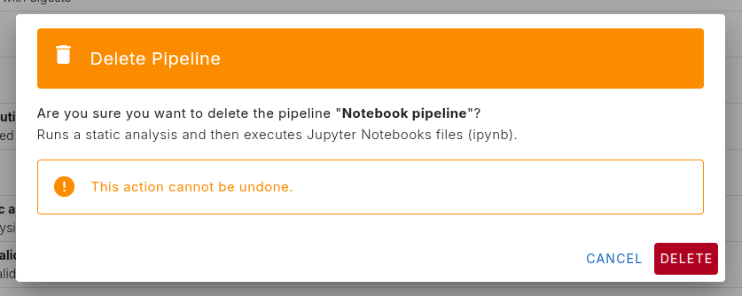

**Important: A deleted pipeline may not be recovered.**

### Manual Execution of Analysis Pipelines

To execute an analysis pipeline manually, navigate to the **Analysis Pipelines** page, identify the pipeline to be executed and click on its  icon. The pipeline execution panel slides from the right side of the window. This panel contains a form with the input parameters of the analysis tools integrated in the pipeline.

Keep or modify the parameters default values as necessary, then click on the **EXECUTE** button.

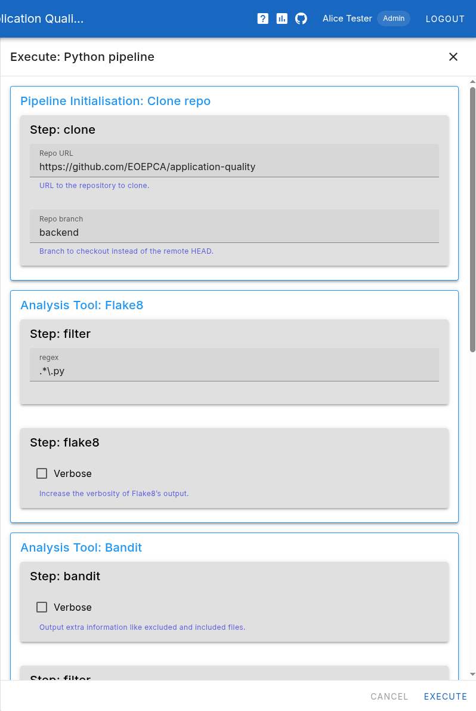

### Pipeline Executions Page

The **Pipeline Executions** page is then automatically displayed, showing the executions of the selected pipeline. The newly triggered execution is displayed at the top of the table.

The following controls are located above the executions table:

- The list of configured pipelines allowing to reveal their executions.
- A Start/Stop button allowing to enable and disable the automatic update of the executions list.

The initial execution status is **Starting**. This indicates that the resources necessary for executing the pipeline tools are being created.

The status turns to **Running** when the analysis tools are executed. A progress bar shows the amount of completed executions over the total amount of tools integrated in the pipeline.

Upon successful completion of the pipeline execution, the status becomes **Succeeded** and the completion date and time are displayed.

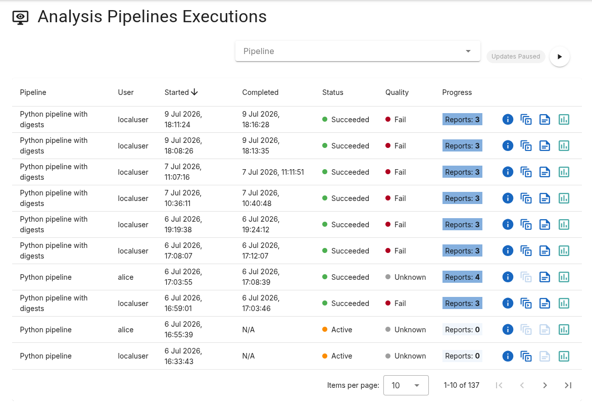

Each row provides the name of the pipeline, the requesting user, the start and completion times, the execution status, the derived quality status (see [Quality Rules and Analysis Digests](#quality-rules-and-analysis-digests)), and a number of action icons:

- Use  to display the pipeline execution details (see below).
- Use  to display the details of the external event that triggered the pipeline execution, if any (see below, and further information in [Pipeline Execution Automation](automation.md)).
- Use  to navigate to the **Execution Reports** page and inspect the report generated by each tool integrated in the pipeline (see [Execution Reports](#inspection-of-the-execution-reports), below).
- Use  to display the dashboard associated with this pipeline execution in **Grafana** (see [Analysis Dashboards](analysis-dashboards.md)).

Example pipeline execution details (truncated):

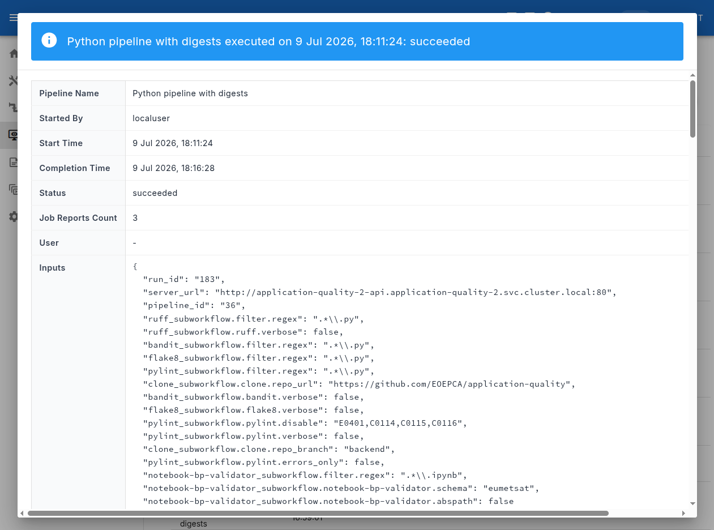

Example pipeline execution trigger event details (truncated):

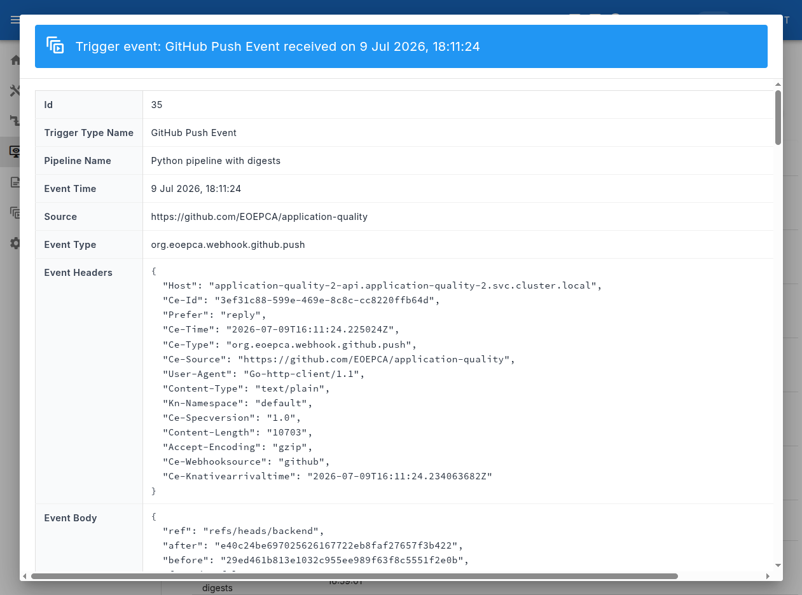

### Inspection of the Execution Reports

Select **Pipelines Executions** in the side menu to access the list of past and on-going executions. Select an analysis pipeline in the list above the page to reveal its most recent executions in the table, then identify an execution and click on its associated  icon. The **Execution Reports** page is then displayed, showing the list of reports generated during the pipeline execution.

Alternatively, select **Execution Reports** in the side menu and select on the page the pipeline and the execution start time to reveal the generated reports.

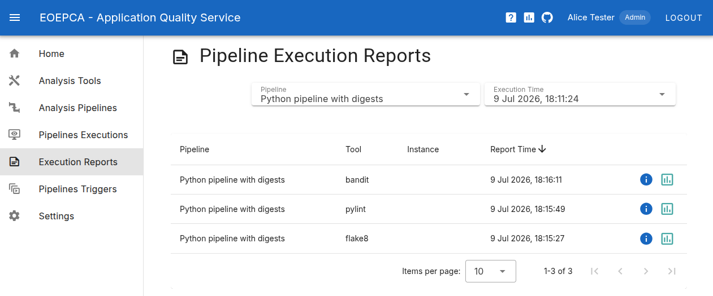

Individual reports may be displayed by clicking on their  icon.

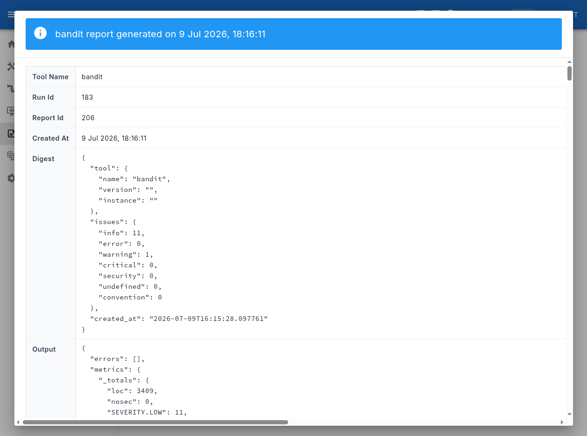

The reports may also be visualised in individual dashboards in Grafana by clicking on their  icon (see [Analysis Dashboards](analysis-dashboards.md)).

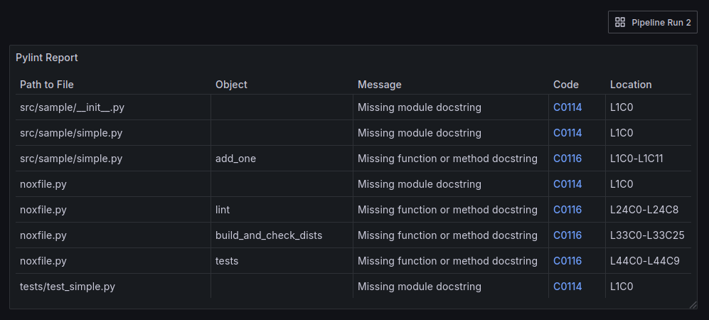

### Quality Rules and Analysis Digests

Each tool generates reports using their own format and terminology. They may be used to investigate individual issues, especially using the [Analysis Dashboards](analysis-dashboards.md) but they do not permit to derive a global quality level for the analysed application code.

For this reason a **Digest** is calculated and included with each Analysis Report. This contains the total amount of comments and issues of different categories: *info*, *warning*, *error*, *security*, etc.

Example digest from a Bandit report:

```json
{
  "tool": {
    "name": "bandit",
    "version": "",
    "instance": ""
  },
  "issues": {
    "info": 11,
    "error": 0,
    "warning": 1,
    "critical": 0,
    "security": 0,
    "undefined": 0,
    "convention": 0
  },
  "created_at": "2026-07-09T16:15:28.097761"
}
```

When the execution of an analysis pipeline is complete, a **Digest** is calculated at the Pipeline Execution (run) level. This has the same structure as the report digests and contains the total amounts from all the reports generated by the pipeline tools.

In addition, Pipeline definitions include **Quality Rules** which allow deriving a global code quality value.

The following Quality Rules indicate that the quality of the analysed code is considered as *very good* (`pass`) if the analysis reports do not contain any errors, warnings, critical issues or security issues. The code is considered as *sufficiently good* (`pass_with_comments`) if there are no errors, and critical or security issues, but there may be some informational comments, warnings and convention-related comments.

If none of the two rules are met, the code quality is considered as *not sufficient* (`fail`).

```json
{
  "pass": "error == 0 and critical == 0 and security == 0 and warning == 0",
  "pass_with_comments": "error == 0 and critical == 0 and security == 0 and (info > 0 or warning > 0 or convention > 0)"
}
```

The calculated pipeline digest contains the issue counters, a copy of the pipeline quality rules, and the global quality level (here: `fail` because the reports contain errors):

```json
{
  "issues": {
    "info": 86,
    "error": 5,
    "warning": 38,
    "critical": 0,
    "security": 0,
    "convention": 127
  },
  "created_at": "2026-07-09T18:16:49.949532",
  "properties": {
    "name": "",
    "version": ""
  },
  "quality_rules": {
    "pass": "error == 0 and critical == 0 and security == 0 and warning == 0",
    "pass_with_comments": "error == 0 and critical == 0 and security == 0 and (info > 0 or warning > 0 or convention > 0)"
  },
  "digest_quality": "fail"
}
```

The Quality Rules can be found in the Pipeline details panels.
The Digests can be found in the Pipeline Execution details and in the individual Execution Reports.
The derived Quality value is also displayed on the [Pipeline Executions Page](#pipeline-executions-page).
