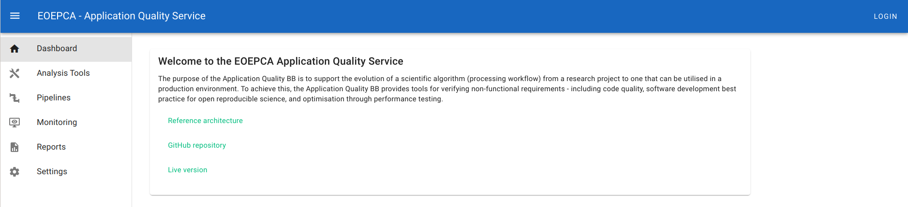
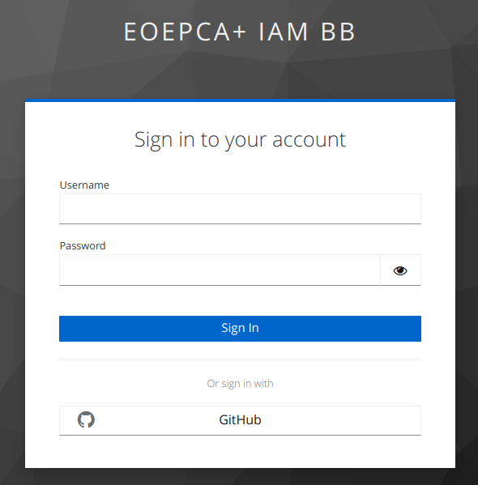
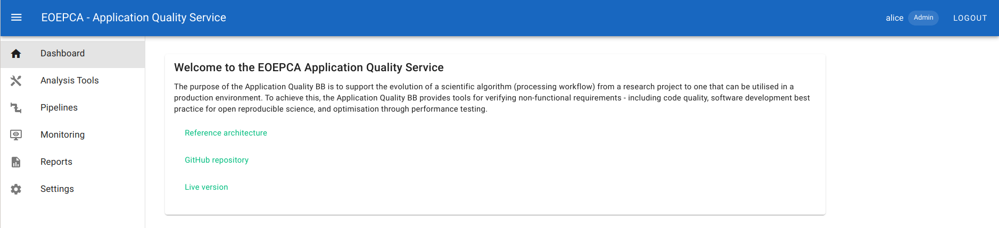
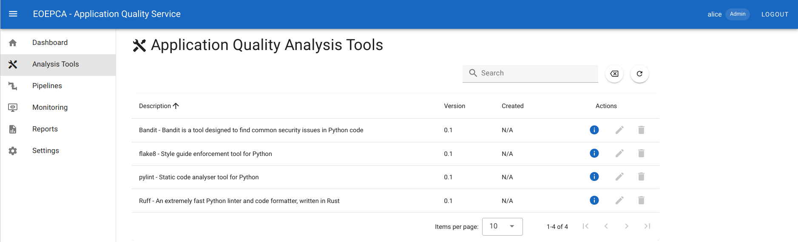
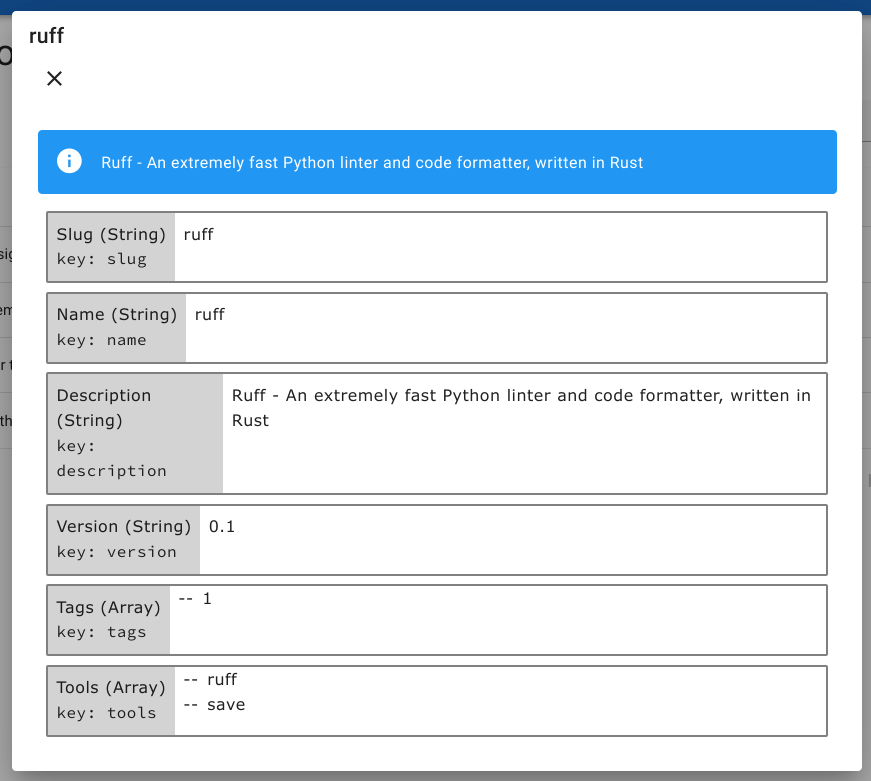
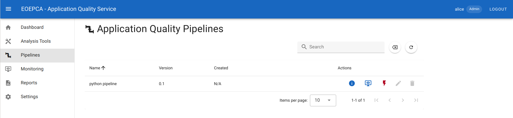
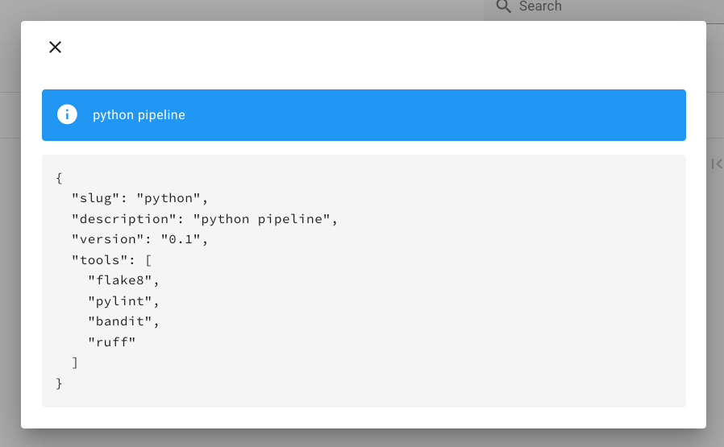
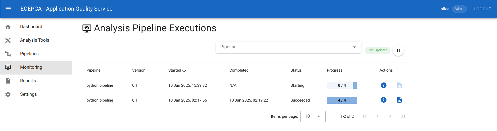
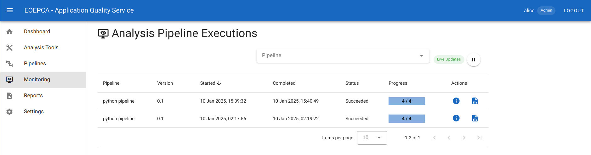

# User Manual

## Introduction

The aim of the Application Quality service is to support the evolution of a scientific algorithm (processing workflow) from a research project to one that can be utilised in a production environment. To achieve this, the Application Quality service provides tools to support verifying non-functional requirements - including code quality, software development best practice for open reproducible science, and optimisation through performance testing.

## Service User Portal

Unauthenticated users may access the service web portal and inspect the available analysis tools and pipelines. They may not create, edit or execue analysis pipelines nor access execution reports.

As seen on the figure below, the portal includes three areas:

- The navigation bar which contains the service name, the login/logout buttons and the name of the authenticated user. A button allows hiding and revealing the side menu.
- A side menu that gives access to different resources managed in the service, including the individual analysis tools, the pipelines, the pipeline runs (executions) and the execution reports.
- The content of the main area depends on the entry selected in the side menu.

### Authentication 

Click on the **LOGIN** link located in the navigation bar to authenticate in the service.

In a default setup, the authentication is performed using the EOEPCA Identity and Access Management (IAM) service. This allows authenticating using a local account or a GitHub account.

Note: A confirmation is requested the first time a GitHub account is used to authenticate in an EOEPCA service. In particular it is asked if the user name and email address may be shared with the service.

Upon successful authentication, the web browser is automatically redirected to the service portal. The navigation bar now shows the user name and a **LOGOUT** link.

In order to log out, click on the **LOGOUT** link. The IAM asks for a confirmation then redirects the browser to the service portal.

### Inspection of analysis tools and pipelines

Select "**Analysis Tools**" in the side menu to reveal a table listing the analysis tools configured in the service.

Analysis tools may not be executed indivitually. They must be integrated in analysis pipelines.

Next to each tool an  icon allows displaying the tool properties.

Select "**Pipelines**" in the side menu to reveal a table listing the analysis pipelines configured in the system.

A pipeline integrates one or more analysis tools. It may be executed on a given Git repository and branch.

Each row provides the name and version a pipeline as well as a series of action icons:

- Use  to display the pipeline properties, including the list of integrated tools.
- Use  to navigate to the **Monitoring** page and inspect the past and on-going executions of the related pipeline.
- Use  to execute the analysis pipeline.

### Execution of analysis pipelines

Note: The Application Quality service currently supports on-demand pipeline executions. In a future release, it will be possible to configure unattended executions triggered by external events.

In order to execute an analysis pipeline, navigate to the **Pipelines** page, identify the pipeline to be executed and click on its  icon. A dialog box is displayed.

Enter the URL of a Git repository and a Git branch (`main` is used by default).

Then click on the **EXECUTE** button.

The **Monitoring** page is then automatically displayed, showing the executions of the selected pipeline. The newly triggered execution is displayed at the top of the table.

The following controls are located above the executions table:

- The list of configured pipelines allowing to reveal their executions.
- A Start/Stop button allowing to enable and disable the automatic update of the executions list.

The initial execution status is **Starting**. This indicates that the resources necessary for executing the pipeline tools are being created.

The status turns to **Running** when the analysis tools are executed. A progress bar shows the amount of completed executions over the total amount of tools integrated in the pipeline.

Upon successful completion of the pipeline execution, the status becomes **Succeeded** and the completion date and time are displayed.

Each row provides the name and version of the pipeline as well as action icons:

- Use  to display the pipeline execution properties.
- Use  to navigate to the **Reports** page and inspect the execution report of each tool integrated in the pipeline.

### Inspection of the execution reports

Select **Monitoring** in the side menu to access the list of past and on-going executions. Select an analysis pipeline in the list above the page to reveal its most recent executions in the table, then identify an execution and click on its associated  icon. The **Reports** page is then displayed, showing the list of reports generated during the pipeline execution.

Alternatively, select **Reports** in the side menu and select on the page the pipeline and the execution start time to reveal the generated reports.

Individual reports may be displayed by clicking on their  icon.

## Analysis Dashboards

This feature is in preparation and will be available in a future release of the Application Quality service.  
